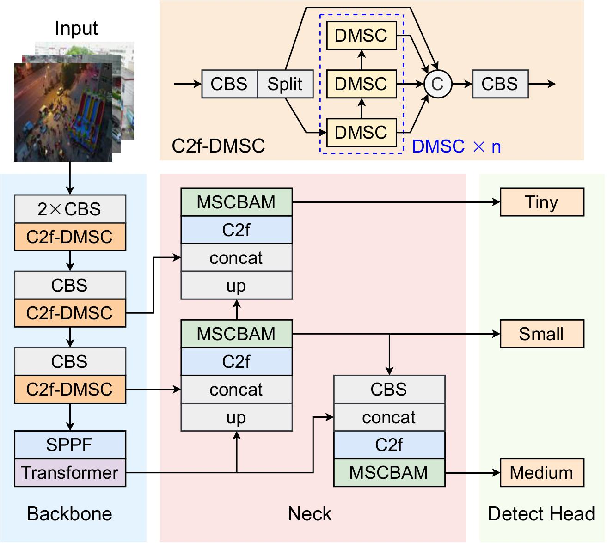
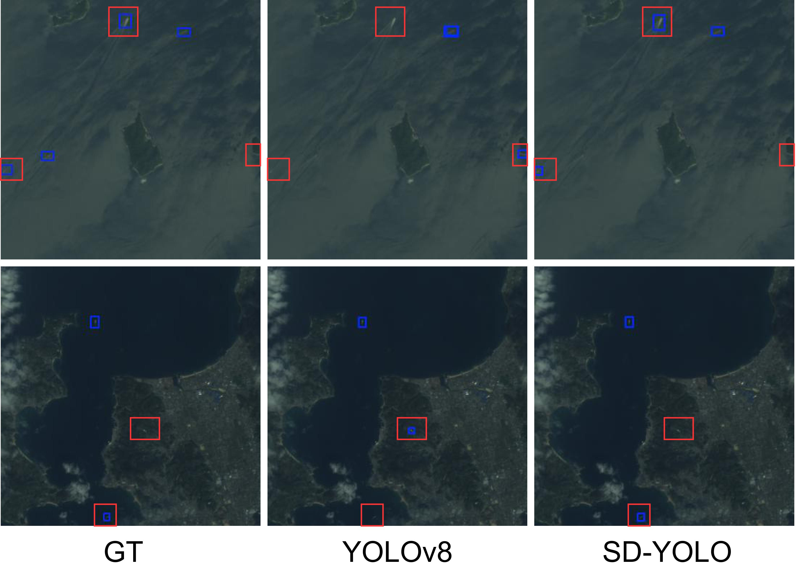

# SD-YOLO: A Lightweight and High-Performance Deep Model for Small and Dense Object Detection

Object detection in remote sensing imagery from unmanned aerial vehicles (UAVs) presents critical challenges for autonomous operations, requiring algorithms that can accurately identify small, densely packed objects in complex backgrounds while maintaining real-time performance on resource-constrained platforms. However, existing detection models often struggle with the inherent trade-off between accuracy and computational efficiency, particularly when dealing with objects smaller than 32×32 pixels that dominate aerial imagery datasets.

To address these limitations, we introduce SD-YOLO, an enhanced object detection architecture built upon YOLOv8 that specifically targets small and dense object detection in challenging remote sensing environments. SD-YOLO incorporates several key architectural innovations designed to maximize detection performance while minimizing computational overhead.

SD-YOLO employs a holistic architectural redesign strategy that combines specialized enhancement with systematic pruning, featuring a C2f-DMSC backbone with Dense Multi-Scale Convolution blocks and integrated Transformer modules for robust multi-scale feature extraction. The architecture includes a Multi-Scale Convolutional Block Attention Module that emphasizes critical regions while expanding the receptive field, and offers two variants (SD-YOLOn and SD-YOLOs) to balance efficiency and accuracy requirements across diverse deployment scenarios.

Comprehensive evaluations demonstrate SD-YOLO's superior performance, with SD-YOLOn achieving 35.8% mAP₀.₅ on VisDrone-2019 while reducing parameters by 65% compared to YOLOv8n, and SD-YOLOs reaching state-of-the-art 79.2% mAP₀.₅ on LEVIR-Ship, establishing new benchmarks for lightweight yet accurate object detection in resource-constrained UAV applications.

The Python code and dataset provided here are included in the under-review paper at Springer Signal Image Video Process.

Phuc-Thinh Huynh, Minh-Thanh Le, Tran Duc Tan, Thien Huynh-The, "SD-YOLO: A Lightweight and High-Performance Deep Model for Small and Dense Object Detection", (2025), Signal Image Video Process.

If there are any errors or topics that need to be discussed, please contact [Phuc-Thinh Huynh]([https://github.com/PhucThinhHuynh]) via email at huynhphucthinh51@gmail.com.
